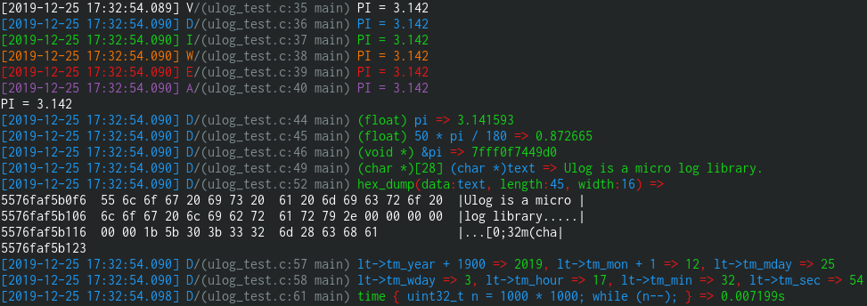

# ulog

[](https://travis-ci.org/shawnfeng0/ulog)

A library written in C/C ++ for printing logs of lightweight embedded devices.

## Platforms and Dependent

* Any C/C++ language environment, only need C standard library support.

* LOGGER_TOKEN and LOGGER_MULTI_TOKEN requires C++11 or GCC extension support, but other functions are not needed.

## Features

* Different log levels
* Log color identification
* Print token (any basic type is automatically recognized and printed)
* Hex dump (print the hexadecimal content in the specified address)
* Statistics code running time

## Quick Demo

### Integration into the project

```bash
git submodule add https://github.com/ShawnFeng0/ulog.git
```

1. As a submodule or [Download](https://github.com/ShawnFeng0/ulog/archive/master.zip) the entire project.

2. Add **ulog/include** to the include path of your project

3. Add ulog / src / ulog.c to the project's source file list

### Code

```C++
#include "ulog/ulog.h"

#include <stdio.h>
#include <time.h>

static uint64_t get_time_us() {
#if defined(WIN32)
  struct timespec tp = {0, 0};
  (void)timespec_get(&tp, TIME_UTC);
  return tp.tv_sec * 1000 * 1000 + tp.tv_nsec / 1000;
#elif defined(__unix__) || defined(__APPLE__)
  struct timespec tp = {0, 0};
  clock_gettime(CLOCK_REALTIME, &tp);
  return static_cast<uint64_t>(tp.tv_sec) * 1000 * 1000 + tp.tv_nsec / 1000;
#else
  // Need to implement a function to get time
  return 0;
#endif
}

static int put_str(void *private_data, const char *str) {
  private_data = private_data; // unused
#if defined(WIN32) || defined(__unix__) || defined(__APPLE__)
  return printf("%s", str);
#else
  return 0;  // Need to implement a function to put string
#endif
}

int main() {
  // Initial logger
  logger_set_time_callback(get_time_us);
  logger_init(nullptr, put_str);

  double pi = 3.14159265;
  // Different log levels
  LOGGER_TRACE("PI = %.3f", pi);
  LOGGER_DEBUG("PI = %.3f", pi);
  LOGGER_INFO("PI = %.3f", pi);
  LOGGER_WARN("PI = %.3f", pi);
  LOGGER_ERROR("PI = %.3f", pi);
  LOGGER_FATAL("PI = %.3f", pi);
  LOGGER_RAW("PI = %.3f\r\n", pi);

  // Output debugging expression
  LOGGER_TOKEN(pi);
  LOGGER_TOKEN(50 * pi / 180);
  LOGGER_TOKEN(&pi);  // print address of pi

  char *text = (char *)"Ulog is a micro log library.";
  LOGGER_TOKEN((char *)text);

  // Hex dump
  LOGGER_HEX_DUMP(text, 45, 16);

  // Output multiple tokens to one line
  time_t now = 1577259816;
  struct tm lt = *localtime(&now);

  LOGGER_MULTI_TOKEN(lt.tm_year + 1900, lt.tm_mon + 1, lt.tm_mday);
  LOGGER_MULTI_TOKEN(lt.tm_wday, lt.tm_hour, lt.tm_min, lt.tm_sec);

  // Output execution time of some statements
  LOGGER_TIME_CODE(

      uint32_t n = 1000 * 1000; while (n--);

  );

  return 0;
}

```

### Output



## Install (Optional, Only in Unix)

If you want to install this library system-wide, you can do so via

```bash
mkdir build && cd build
cmake ../
sudo make install
```

## How to use

Detailed documentation is described in ulog.h

### 1 Initialization (**Non-Unix** platforms)

Unix platform has default configuration, you can use it directly without configuration

#### 1.1 Set the log mutex (Can only be called before using the print function)

Note: **Unix-like platforms have default settings, so this function cannot be called.**

The log library uses the same buffer and log number variable, so be sure to set this if you use it in different threads. It should be set before the log library is used.

```C
void logger_set_mutex_lock(void *mutex, LogMutexLock mutex_lock_cb, LogMutexUnlock mutex_unlock_cb);

// Sample(posix thread)
static pthread_mutex_t log_pthread_mutex = PTHREAD_MUTEX_INITIALIZER;
int pthread_mutex_lock_wrapper(void *__mutex) {
  return pthread_mutex_lock((pthread_mutex_t *) __mutex);
}
int pthread_mutex_unlock_wrapper(void *__mutex) {
  return pthread_mutex_unlock((pthread_mutex_t *) __mutex);
}

int main(int argc, char *argv[]) {
  logger_set_mutex_lock(&log_pthread_mutex, pthread_mutex_lock_wrapper, pthread_mutex_lock_wrapper);
  // ...
}
```

#### 1.2 Set the callback to get the time

```C
void logger_set_time_callback(LogGetTimeUs get_time_us_cb);

// Sample(unix)
static uint64_t get_time_us() {
  struct timespec tp = {0, 0};
  clock_gettime(CLOCK_REALTIME, &tp);
  return static_cast<uint64_t>(tp.tv_sec * 1000 * 1000 + tp.tv_nsec / 1000);
}

int main(int argc, char *argv[]) {
  logger_set_time_callback(get_time_us);
  // ...
}
```

#### 1.3 Initialize the logger and set the string output callback function

The simplest configuration is just to configure the output callback.

private_data: Set by the user, each output will be passed to output_cb, output can be more flexible.
 
```C
void logger_init(void *private_data, LogOutput output_cb);

// Sample
static int put_str(void *private_data, const char *str) {
  private_data = private_data;
  return printf("%s", str);
}
int main(int argc, char *argv[]) {
  logger_init(NULL, put_str);
  // ...
}
```

### 2 Print log

#### 2.1 Normal log

Same format as **printf**.

```C
double pi = 3.14159265;
LOGGER_TRACE("PI = %.3f", pi);
LOGGER_DEBUG("PI = %.3f", pi);
LOGGER_INFO("PI = %.3f", pi);
LOGGER_WARN("PI = %.3f", pi);
LOGGER_ERROR("PI = %.3f", pi);
LOGGER_FATAL("PI = %.3f", pi);
LOGGER_RAW("PI = %.3f\r\n", pi);

/* Output: ---------------------------------------------------------------
[2020-02-05 18:48:55.111] 14890-14890 T/(ulog_test.cpp:47 main) PI = 3.142
[2020-02-05 18:48:55.111] 14890-14890 D/(ulog_test.cpp:48 main) PI = 3.142
[2020-02-05 18:48:55.111] 14890-14890 I/(ulog_test.cpp:49 main) PI = 3.142
[2020-02-05 18:48:55.111] 14890-14890 W/(ulog_test.cpp:50 main) PI = 3.142
[2020-02-05 18:48:55.111] 14890-14890 E/(ulog_test.cpp:51 main) PI = 3.142
[2020-02-05 18:48:55.111] 14890-14890 F/(ulog_test.cpp:52 main) PI = 3.142
*/
```

#### 2.2 Print variable (Requires C++ 11 or GNU extension)

Output various tokens, the function will automatically recognize the type of token and print.

```C
/*
  @param token Can be float, double, [unsigned / signed] char / short / int / long / long long and pointers of the above type
 */
#define LOGGER_TOKEN(token) ...
```

Output multiple tokens to one line, each parameter can be a different type

```C
/**
 * @param token Same definition as LOGGER_TOKEN parameter, but can output up to 16
 * tokens at the same time
 */
#define LOGGER_MULTI_TOKEN(...) ...
```

Example:

```C
double pi = 3.14;
LOGGER_TOKEN(pi);
LOGGER_TOKEN(pi * 50.f / 180.f);
LOGGER_TOKEN(&pi);  // print address of pi

time_t now = 1577232000; // 2019-12-25 00:00:00
struct tm* lt = localtime(&now);
LOGGER_MULTI_TOKEN(lt->tm_year + 1900, lt->tm_mon + 1, lt->tm_mday);

/* Output: ---------------------------------------------------------
(float) pi => 3.140000
(float) pi * 50.f / 180.f => 0.872222
(void *) &pi => 7fff2f5568d8
lt->tm_year + 1900 => 2019, lt->tm_mon + 1 => 12, lt->tm_mday => 25
*/
```

#### 2.3 Hex dump

Display contents in hexadecimal and ascii. Same format as "hexdump -C filename"

```C
/*
 * @param data The starting address of the data to be displayed
 * @param length Display length starting from "data"
 * @param width How many bytes of data are displayed in each line
 */
#define LOGGER_HEX_DUMP(data, length, width) ...
```

Example:

```C
char str1[5] = "test";
char str2[10] = "1234";
LOGGER_HEX_DUMP(&str1, 20, 16);

/* Output: ---------------------------------------
hex_dump(data:&str1, length:20, width:8) =>
7fff2f556921  74 65 73 74  00 31 32 33  |test.123|
7fff2f556929  34 00 00 00  00 00 00 30  |4......0|
7fff2f556931  d3 a4 9b a7               |....|
7fff2f556935
*/
```

#### 2.4 Statistics code running time

```C
#define LOGGER_TIME_CODE(...) ...
```

Example:

```C
LOGGER_TIME_CODE(

uint32_t n = 1000 * 1000;
while (n--);

);

/* Output: -----------------------------------------------
time { uint32_t n = 1000 * 1000; while (n--); } => 1315us
*/
```

### 3 Format customization

```C
// Enable log output, which is enabled by default
void logger_enable_output(bool enable);
```

```C
// Enable color output, which is enabled by default
void logger_enable_color(bool enable);
```

```C
// Enable log number output, disabled by default
void logger_enable_number_output(bool enable);
```

```C
// Enable log time output, enabled by default
void logger_enable_time_output(bool enable);
```

```C
// Enable process and thread id output, enabled by default (Only in unix like platform)
void logger_enable_process_id_output(bool enable);
```

```C
// Enable log level output, enabled by default
void logger_enable_level_output(bool enable);
```

```C
// Enable log file line output, enabled by default
void logger_enable_file_line_output(bool enable);
```

```C
// Enable log function name output, enabled by default
void logger_enable_function_output(bool enable);
```

```C
// Set the log level. Logs below this level will not be output
// The default level is the lowest level, so logs of all levels are output.

// Different levels:
// ULOG_LEVEL_TRACE
// ULOG_LEVEL_DEBUG
// ULOG_LEVEL_INFO
// ULOG_LEVEL_WARN
// ULOG_LEVEL_ERROR
// ULOG_LEVEL_FATAL
void logger_set_output_level(LogLevel level);
```

```C
// Set time output format
// LOG_TIME_FORMAT_TIMESTAMP: Output like this: 1576886405.225
// LOG_TIME_FORMAT_LOCAL_TIME: Output like this: 2019-01-01 17:45:22.564

void logger_set_time_format(LogTimeFormat time_format);
```
