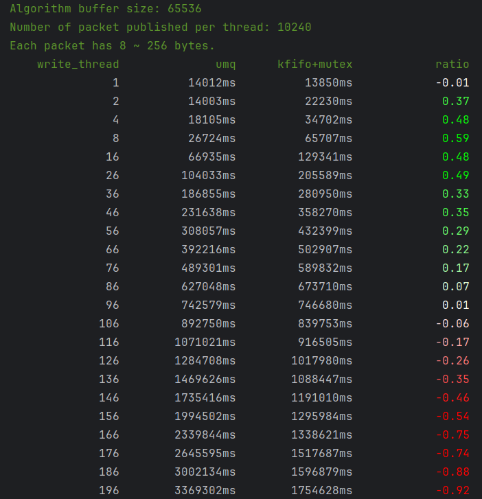
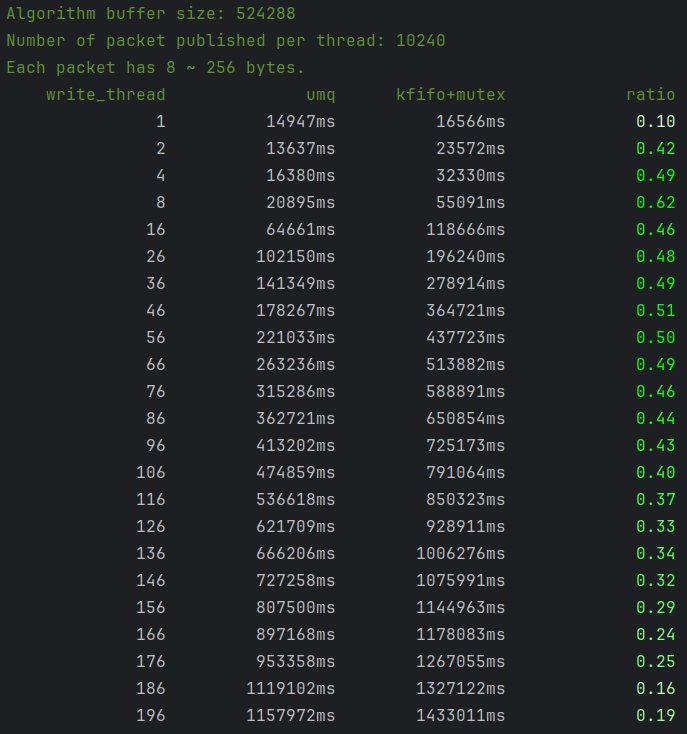

# MPSC Benchmarks

MPSC is a lock-free queue implementation. Its internal logic is more complex than a traditional lock-based queue, and it only demonstrates its maximum performance advantage when there is no waiting. If waiting occurs, its performance can actually be lower than kfifo+mutex. This explains why, in the later stages of the 64KB test, MPSC consistently underperforms compared to the traditional ring buffer implementation.

In contrast, with a larger buffer size (e.g., 512KB), the queue is less likely to be full, so threads spend less time waiting. This allows MPSC to fully demonstrate its performance advantage, reaching up to 1.5x the performance of the traditional ring buffer (limited by CPU cache coherence, so performance cannot increase linearly).

## Benchmark Description
- Benchmark file: `mpsc_benchmarks.cc`
- Compares UMQ (multi-producer queue) and kfifo+mutex (ring buffer + mutex) under varying thread counts.
- Each thread publishes 10*1024 packets, each packet is 8~256 bytes.
- The `ratio` column uses color gradients to indicate performance difference:
  - Negative: white-to-red gradient (UMQ is slower than kfifo+mutex)
  - Positive: white-to-green gradient (UMQ is faster than kfifo+mutex)

## Results

### Buffer Size = 64KB

### Buffer Size = 512KB

